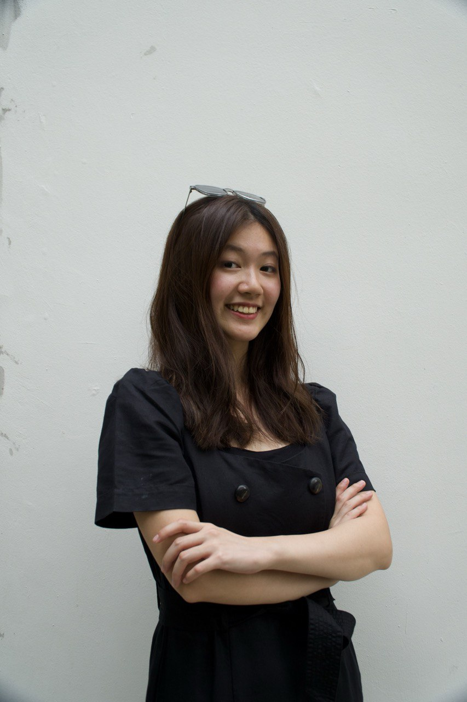

# About Us

We are a team based in the [School of Computing, National University of Singapore](http://www.comp.nus.edu.sg).

Check us out on [Github](https://github.com/AY2526S2-CS2103T-T08-1/tp)! 

## Project team

### Xing Yu

[[github](https://github.com/cxyu629)]
[[portfolio](team/johndoe.md)]

* Role: Team Lead, Developer
* Responsibilities: Deadlines, Scheduling and Tracking

### Chen Ping

[[github](http://github.com/p12010304)]
[[portfolio](team/johndoe.md)]

* Role: Documentation
* Responsibilities: In charge of UI component, maintaining the quality of project documents (UG/DG), and ensuring deliverables meet project standards.

### Davin Khor

[[github](http://github.com/deltaMinor)] [[portfolio](team/johndoe.md)]

* Role: Developer
* Responsibilities: Code Quality, In charge of UI Mockup

### Allison Law

[[github](http://github.com/allisonllx)]
[[portfolio](team/allisonllx.md)]

* Role: Testing
* Responsibilities: Ensures the testing of the project is done properly and on time

### Justin Cheng

[[github](http://github.com/justatin555)]
[[portfolio](team/johndoe.md)]

* Role: Developer
* Responsibilities: Deliverables + Integration
