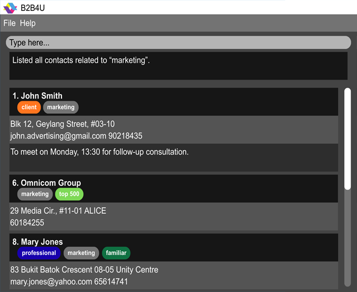

# B2B4U User Guide

Business to Business for You (B2B4U) is a **desktop app for managing contacts, optimized for use via a  Line Interface** (CLI) while still having the benefits of a Graphical User Interface (GUI). If you can type fast, B2B4U can get your contact management tasks done faster than traditional GUI apps.

<!-- * Table of Contents -->
<page-nav-print />

--------------------------------------------------------------------------------------------------------------------

## Quick start

1. Ensure you have Java `17` or above installed in your Computer. 
   **Mac users:** Ensure you have the precise JDK version prescribed [here](https://se-education.org/guides/tutorials/javaInstallationMac.html).

1. Download the latest `.jar` file from [here](https://github.com/se-edu/addressbook-level3/releases).

1. Copy the file to the folder you want to use as the _home folder_ for your AddressBook.

1. Open a command terminal, `cd` into the folder you put the jar file in, and use the `java -jar addressbook.jar` command to run the application. 
   A GUI similar to the below should appear in a few seconds. Note how the app contains some sample data. 
   

1. Type the command in the command box and press Enter to execute it. e.g. typing **`help`** and pressing Enter will open the help window. 
   Some example commands you can try:

   * `list` : Lists all contacts.

   * `add n/John Doe p/98765432 e/johnd@example.com a/John street, block 123, #01-01` : Adds a contact named `John Doe` to the Address Book.

   * `view 1` : Opens the detail panel for the 1st contact.

   * `close view` : Closes the contact detail panel.

   * `delete 3` : Deletes the 3rd contact shown in the current list.

   * `clear` : Deletes all contacts.

   * `exit` : Exits the app.

1. Refer to the [Features](#features) below for details of each command.

--------------------------------------------------------------------------------------------------------------------

## Features

<box type="info" seamless>

**Notes about the command format:** 

* Words in `UPPER_CASE` are the parameters to be supplied by the user. 
  e.g. in `add n/NAME`, `NAME` is a parameter which can be used as `add n/John Doe`.

* Items in square brackets are optional. 
  e.g `n/NAME [t/TAG]` can be used as `n/John Doe t/friend` or as `n/John Doe`.

* Items with `…`​ after them can be used multiple times including zero times. 
  e.g. `[t/TAG]…​` can be used as ` ` (i.e. 0 times), `t/friend`, `t/friend t/family` etc.

* Parameters can be in any order. 
  e.g. if the command specifies `n/NAME p/PHONE_NUMBER`, `p/PHONE_NUMBER n/NAME` is also acceptable.

* Extraneous parameters for commands that do not take in parameters (such as `help`, `list`, `exit` and `clear`) will be ignored. 
  e.g. if the command specifies `help 123`, it will be interpreted as `help`.

* If you are using a PDF version of this document, be careful when copying and pasting commands that span multiple lines as space characters surrounding line-breaks may be omitted when copied over to the application.

* If a command is not recognised, an error message will be displayed. 
  
</box>

### Viewing help: `help`

Shows a message explaining how to access the help page.

Format: `help`

### Adding a contact: `add`

Adds a contact to the address book.

Format: `add n/NAME [p/PHONE_NUMBER] [e/EMAIL] [a/ADDRESS] [lc/LAST_CONTACTED] [t/TAG]…​`

<box type="tip" seamless>

**Tip:** A contact can have any number of tags (including 0). At least one of `p/PHONE_NUMBER` or `e/EMAIL` must be provided.
</box>

* Names are standardised to Title Case (e.g. `john doe` becomes `John Doe`).
* Phone numbers accept digits, spaces, and `+`. Numbers starting with `+` (country code) must be 8–15 digits; otherwise 5–14 digits.
* Tags accept alphanumeric strings in the format `TAG` or `TAG:RANK` (e.g. `friend`, `client:vip`).
* `LAST_CONTACTED` accepts most conventional date/time formats (e.g. `22/02/2026`, `15 Apr`, `today`).

Examples:
* `add n/John Doe p/98765432 e/johnd@example.com a/John street, block 123, #01-01`
* `add n/Betsy Crowe t/friend e/betsycrowe@example.com a/Newgate Prison p/1234567 t/criminal`
* `add n/Alex Tan p/91234567`
* `add n/Jane Smith e/jane@example.com lc/22/02/2026`

### Listing all contacts: `list`

Shows a list of all contacts in the address book.

Format: `list`

### Viewing a specific contact: `view`

Displays a specific contact's full details in a side panel.

Format: `view INDEX`

* Displays the contact at the specified `INDEX` in a separate panel.
* The index refers to the index number shown in the displayed contact list.
* The index **must be a positive integer** 1, 2, 3, …​
* If the viewed contact is subsequently edited (e.g. via `edit` or `note`), the detail panel updates automatically to reflect the changes.

Example:
* `view 1` displays the details of the 1st contact.

### Closing the contact detail panel: `close view`

Closes the currently open contact detail panel and returns to the main list view.

Format: `close view`

* Does not require any index or additional parameters.
* If no contact panel is currently open, the command still executes without error.

Example:
* `close view`

### Editing a contact: `edit`

Edits an existing contact in the address book.

Format: `edit INDEX [n/NAME] [p/PHONE] [e/EMAIL] [a/ADDRESS] [lc/LAST_CONTACTED] [t/TAG]…​`

* Edits the contact at the specified `INDEX`. The index refers to the index number shown in the displayed contact list. The index **must be a positive integer** 1, 2, 3, …​
* At least one of the optional fields must be provided.
* Existing values will be updated to the input values.
* When editing tags, the existing tags of the contact will be removed i.e adding of tags is not cumulative.
* You can remove all the contact's tags by typing `t/` without
    specifying any tags after it.

Examples:
*  `edit 1 p/91234567 e/johndoe@example.com` Edits the phone number and email address of the 1st contact to be `91234567` and `johndoe@example.com` respectively.
*  `edit 2 n/Betsy Crower t/` Edits the name of the 2nd contact to be `Betsy Crower` and clears all existing tags.
*  `edit 3 lc/today` Updates the last contacted date of the 3rd contact to today.

### Adding notes/reminders to a contact: `note`

Manages notes and reminders for an existing contact in the address book.

**Add a note:**

Format: `note INDEX NOTE [on/TIME]`

* Appends `NOTE` to the contact at the specified `INDEX`. The index **must be a positive integer** 1, 2, 3, …​
* New notes are stacked underneath existing ones.
* `TIME` can accept most conventional date/time formats and may omit the year. If unable to parse as a date, it will be saved as a plain string.
* Filling the `on/TIME` field turns the note into a reminder. The system will warn of reminders due within 1 week.

Examples:
* `note 1 Likes to swim.`
* `note 2 Follow up call on/15 Apr`

**Remove the first N notes:**

Format: `note INDEX c/LINES_TO_REMOVE`

* Removes the first `LINES_TO_REMOVE` notes from the contact at the specified `INDEX`.
* `LINES_TO_REMOVE` must be a non-negative integer.
* If `LINES_TO_REMOVE` exceeds the number of existing notes, all notes are removed.

Examples:
* `note 1 c/1` removes the first note from the 1st contact.
* `note 2 c/3` removes the first 3 notes from the 2nd contact.

**Clear all notes:**

Format: `note INDEX ca/`

* Removes all notes from the contact at the specified `INDEX`.

Example:
* `note 1 ca/`

### Finding contacts: `find`

Finds contacts whose fields match the specified search criteria.

Format: `find [KEYWORD]… [n/NAME] [p/PHONE] [e/EMAIL] [a/ADDRESS] [t/TAG]…`

* The search is case-insensitive. e.g. `hans` will match `Hans`.
* Unprefixed `KEYWORD`s search across all fields (name, phone, email, address, notes, tags) using partial matching. Each keyword must appear somewhere in the contact.
* Prefixed searches (`n/`, `p/`, `e/`, `a/`) filter by the specified field using partial matching.
* `t/TAG` filters by tag using **exact** matching (e.g. `t/friend` will not match a tag named `friends`).
* All search conditions are combined with **AND** logic — only contacts satisfying **every** condition are returned.
* At least one search condition must be provided.

Examples:
* `find John` returns contacts containing `john` in any field.
* `find n/Alex` returns contacts with `Alex` in their name.
* `find p/94` returns contacts with `94` in their phone number.
* `find a/street t/friends` returns contacts that have `street` in their address **and** the exact tag `friends`.

### Deleting a contact: `delete`

Deletes the specified contact from the address book.

Format: `delete INDEX`

* Deletes the contact at the specified `INDEX`.
* The index refers to the index number shown in the displayed contact list.
* The index **must be a positive integer** 1, 2, 3, …​

Examples:
* `list` followed by `delete 2` deletes the 2nd contact in the address book.
* `find Betsy` followed by `delete 1` deletes the 1st contact in the results of the `find` command.

### Undoing a command: `undo`

Reverts the last executed command that modified data.

Format: `undo`

* Only commands that modify data can be undone (e.g. `add`, `edit`, `delete`, `note`, `clear`, `sort`).
* Commands that do not modify data (`help`, `view`, `close view`, `list`, `find`, `undo`, `redo`, `exit`) are ignored by undo.
* Displays the feedback of the undone command.

Examples:
* `delete 1` followed by `undo` restores the deleted contact.
* `edit 1 n/New Name` followed by `undo` reverts the name change.

### Redoing a command: `redo`

Reverses the effect of an `undo` command, effectively re-applying the previously undone action.

Format: `redo`

* Only applicable after an `undo` command has been executed.
* Commands that do not modify data (`help`, `view`, `close view`, `list`, `find`, `undo`, `redo`, `exit`) are ignored by redo.
* Displays the feedback of the redone command.

Examples:
* `delete 1` then `undo` then `redo` re-deletes the 1st contact.
* `edit 1 n/New Name` then `undo` then `redo` re-applies the name change.

### Sorting contacts: `sort`

Sorts the currently displayed contacts by the specified field(s).

Format: `sort [n/] [p/] [e/] [a/] [lu/] [lc/] [t/TAG_NAME]…`

* Sorts by the fields indicated by each prefix, in the order the prefixes are given.
* `n/` — sort by name, `p/` — sort by phone, `e/` — sort by email, `a/` — sort by address, `lu/` — sort by last updated, `lc/` — sort by last contacted.
* `t/TAG_NAME` — contacts with the ranked tag `TAG_NAME` are displayed at the top.
* At least one sort criterion must be provided.

Examples:
* `sort n/` sorts all contacts alphabetically by name.
* `sort lu/` sorts contacts by when they were last updated.
* `sort n/ t/vip` sorts contacts alphabetically by name, with contacts tagged `vip` shown first.

### Clearing all entries: `clear`

Clears all entries from the address book.

Format: `clear`

### Exiting the program: `exit`

Exits the program.

Format: `exit`

### Saving the data

AddressBook data are saved in the hard disk automatically after any command that changes the data. There is no need to save manually.

### Editing the data file

AddressBook data are saved automatically as a JSON file `[JAR file location]/data/addressbook.json`. Advanced users are welcome to update data directly by editing that data file.

<box type="warning" seamless>

**Caution:**
If your changes to the data file makes its format invalid, AddressBook will discard all data and start with an empty data file at the next run.  Hence, it is recommended to take a backup of the file before editing it. 
Furthermore, certain edits can cause the AddressBook to behave in unexpected ways (e.g., if a value entered is outside the acceptable range). Therefore, edit the data file only if you are confident that you can update it correctly.
</box>

### Archiving data files `[coming in v2.0]`

_Details coming soon ..._

--------------------------------------------------------------------------------------------------------------------

## FAQ

**Q**: How do I transfer my data to another Computer? 
**A**: Install the app in the other computer and overwrite the empty data file it creates with the file that contains the data of your previous AddressBook home folder.

--------------------------------------------------------------------------------------------------------------------

## Known issues

1. **When using multiple screens**, if you move the application to a secondary screen, and later switch to using only the primary screen, the GUI will open off-screen. The remedy is to delete the `preferences.json` file created by the application before running the application again.
2. **If you minimize the Help Window** and then run the `help` command (or use the `Help` menu, or the keyboard shortcut `F1`) again, the original Help Window will remain minimized, and no new Help Window will appear. The remedy is to manually restore the minimized Help Window.

--------------------------------------------------------------------------------------------------------------------

## Command summary

| Action             | Format, Examples                                                                                                                                                                                |
| ------------------ | ----------------------------------------------------------------------------------------------------------------------------------------------------------------------------------------------- |
| **Help**           | `help`                                                                                                                                                                                          |
| **Add contact**    | `add n/NAME [p/PHONE_NUMBER] [e/EMAIL] [a/ADDRESS] [lc/LAST_CONTACTED] [t/TAG]…​`   e.g., `add n/James Ho p/22224444 e/jamesho@example.com a/123, Clementi Rd, 1234665 t/friend t/colleague` |
| **Edit contact**   | `edit INDEX [n/NAME] [p/PHONE_NUMBER] [e/EMAIL] [a/ADDRESS] [lc/LAST_CONTACTED] [t/TAG]…​`  e.g.,`edit 2 n/James Lee e/jameslee@example.com`                                                 |
| **Delete contact** | `delete INDEX`  e.g., `delete 3`                                                                                                                                                             |
| **Clear contacts** | `clear`                                                                                                                                                                                         |
| **Note (add)**     | `note INDEX NOTE [on/TIME]`   e.g., `note 1 To meet in February on/15 Apr`                                                                                                                   |
| **Note (remove)**  | `note INDEX c/LINES_TO_REMOVE`   e.g., `note 1 c/2`                                                                                                                                          |
| **Note (clear)**   | `note INDEX ca/`   e.g., `note 1 ca/`                                                                                                                                                        |
| **List contacts**           | `list`                                                                                                                                                                                          |
| **Find contacts**           | `find [KEYWORD]… [n/NAME] [p/PHONE] [e/EMAIL] [a/ADDRESS] [t/TAG]…`  e.g., `find n/James t/friends`                                                                                          |
| **Sort contacts**           | `sort [n/] [p/] [e/] [a/] [lu/] [lc/] [t/TAG_NAME]…`   e.g., `sort n/`                                                                                                                       |
| **Undo**           | `undo`                                                                                                                                                                                          |
| **Redo**           | `redo`                                                                                                                                                                                          |
| **View contact**           | `view INDEX`   e.g., `view 1`                                                                                                                                                                |
| **Close view**     | `close view`                                                                                                                                                                                    |
